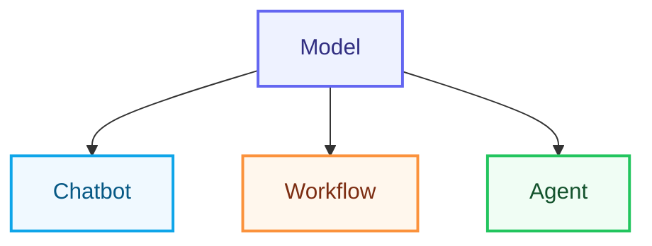
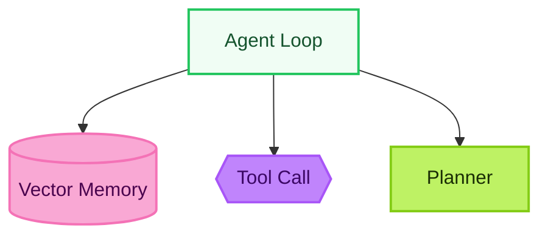

# TedT.org

[](https://github.com/TedTschopp/tedt.org/actions/workflows/deploy.yml)
[](https://github.com/TedTschopp/tedt.org/actions/workflows/mastodon-feed.yml)
[](https://github.com/TedTschopp/tedt.org/actions/workflows/dusd-lunch-menu.yml)
[](https://github.com/TedTschopp/tedt.org/actions/workflows/daily-report.lock.yml)
[](https://github.com/TedTschopp/tedt.org/actions/workflows/yesterday-in-ai.lock.yml)
[](https://github.com/TedTschopp/tedt.org/actions/workflows/purge-actions-caches.yml)

Welcome to the repository for my personal homepage, [TedT.org](https://tedt.org). This site is a collection of my projects, writings, and interests, built using Jekyll and various open-source tools.

## Features

This site includes:

- A blog with categorized posts.
- A collection of tools, resources, and experiments.
- Integration with Mastodon and other social platforms.
- Custom scripts for managing and generating content.

## Technology Stack (Condensed)

Key technologies and architectural decisions powering the site:

### Core & Build

- Jekyll 4.3.x+ for static site generation (Liquid templating).
- Ruby (CI uses >= 3.1) + Bundler; conditional gem constraints for security (see Gemfile comments).
- Performance instrumentation & category recent post caching ([ADR 0008](docs/adr/0008-memory-probe-and-caching.md)).

### Content & Structure

- Markdown posts under `_posts/` (includes slide decks under `_posts/Slides/` per [ADR 0012](docs/adr/0012-posts-based-slides.md)).
- Unified category theming / registry ([ADR 0006](docs/adr/0006-carousel-registry-driven-accessibility.md) & [ADR 0007](docs/adr/0007-category-theming-unification.md)) via `_data/category_registry.yml`.
- Front matter feature flags: `no_toc` ([ADR 0010](docs/adr/0010-no-toc-front-matter-flag.md)), `mermaid` ([ADR 0011](docs/adr/0011-mermaid-front-matter-flag.md)); article video metadata via `video`.

### Presentation & Styling

- SCSS partials in `_sass/`; slides theme + archetypes for Reveal.js.
- Rouge for syntax highlighting.
- Reveal.js integrated via `layout: reveal-integrated` (no separate collection; path-filtered posts).

### Client-Side Behavior

- Randomized category carousel start ([ADR 0003](docs/adr/0003-random-carousel-start-position.md)).
- Slide topic filtering (pure client JS; no synthetic placeholders).

### Social / Syndication

- Mastodon integration & backfill scripts in `_code/` (Python utilities).
- RSS / JSON feeds (Liquid + helper scripts).

### Quality & Security

- HTML Proofer and feed integrity checks in CI.
- `recent_by_category` cache validation guards the homepage/category fast path against registry alias drift.
- Memory probe & optional periodic GC (env gated) for diagnostics ([ADR 0008](docs/adr/0008-memory-probe-and-caching.md)).
- `ffi` pinned to 1.16.3 for stability ([ADR 0009](docs/adr/0009-ffi-downgrade-stability-and-upgrade-path.md)) until upgrade conditions met.

For deeper details and rationale, consult ADRs in `docs/adr/`.

## ADRs Overview

Architecture Decision Records (ADRs) capture high-impact, relatively irreversible technical choices with their context, rationale, and consequences. This repository maintains an index (`docs/adr/0000-index.md`) enumerating active, proposed, and deprecated decisions. When proposing a major change (performance model, collection introduction, new feature flag, library adoption) draft a new ADR rather than rewriting an accepted one.

Guidelines:

- Status lifecycle: Proposed → Accepted → (optionally) Deprecated / Superseded.
- Never renumber ADR files—historic permalinks must remain stable.
- Link related ADRs via a "See Also" section when cross-cutting concerns exist.
- Keep ADRs concise; move deep experimental analysis to `docs/planning/`.

Index: See [ADR Index](docs/adr/0000-index.md).

### Documentation Maintenance Utilities

To keep the README Table of Contents current:

- Regenerate after heading changes: `make docs-toc` (runs the `_code/update_readme_toc.py --write` script).
- Validate in CI / locally: `make check-toc` (non-zero exit if drift detected).
- Optional pre-commit hook: copy `tools/git-hooks/pre-commit-toc-check.sh` to `.git/hooks/pre-commit` and make it executable:

```bash
cp tools/git-hooks/pre-commit-toc-check.sh .git/hooks/pre-commit
chmod +x .git/hooks/pre-commit
```

Override check for emergency commits with `SKIP_TOC=1 git commit -m "..."`.

## Table of Contents


1. [TedT.org](#tedtorg)
   2. [Features](#features)
   3. [Technology Stack (Condensed)](#technology-stack-condensed)
      - [Core & Build](#core-build)
      - [Content & Structure](#content-structure)
      - [Presentation & Styling](#presentation-styling)
      - [Client-Side Behavior](#client-side-behavior)
      - [Social / Syndication](#social-syndication)
      - [Quality & Security](#quality-security)
   4. [ADRs Overview](#adrs-overview)
      - [Documentation Maintenance Utilities](#documentation-maintenance-utilities)
   5. [Repository Structure](#repository-structure)
   6. [Include Standards](#include-standards)
      - [Directory Structure](#directory-structure)
      - [Directory Purposes](#directory-purposes)
      - [Analytics Baseline](#analytics-baseline)
      - [Naming Conventions](#naming-conventions)
      - [Usage Examples](#usage-examples)
      - [Adding New Includes](#adding-new-includes)
      - [Migration from Old Structure](#migration-from-old-structure)
      - [Quick Reference](#quick-reference)
   7. [Acknowledgments](#acknowledgments)
   8. [Custom Scripts](#custom-scripts)
   9. [How to Contribute](#how-to-contribute)
      - [Local Development](#local-development)
      - [Game Theory Playground](#game-theory-playground)
      - [Testing the Site](#testing-the-site)
   10. [Quality Gates](#quality-gates)
   11. [GitHub Workflows Overview](#github-workflows-overview)
   12. [Front Matter Feature Flags](#front-matter-feature-flags)
      - [Substack publishing opt-in](#substack-publishing-opt-in)
   13. [Responsive WebP Images](#responsive-webp-images)
   14. [Article Video Front Matter](#article-video-front-matter)
      - [Slide Deck Front Matter (Standalone HTML Default)](#slide-deck-front-matter-standalone-html-default)
      - [Slide Index Behavior](#slide-index-behavior)
      - [Legacy Reveal Includes](#legacy-reveal-includes)
      - [Client-Side Search and Topic Filtering](#client-side-search-and-topic-filtering)
      - [Legacy Reveal Styling Utilities](#legacy-reveal-styling-utilities)
      - [Legacy Reveal Global Theme](#legacy-reveal-global-theme)
      - [Legacy Reveal Archetype Classes & Usage](#legacy-reveal-archetype-classes-usage)
      - [Legacy Reveal Deck Style Front Matter](#legacy-reveal-deck-style-front-matter)
      - [Mermaid Diagrams Usage](#mermaid-diagrams-usage)
   15. [Homepage Hero System & Caching](#homepage-hero-system-caching)
      - [How It Works](#how-it-works)
      - [Adding / Updating a Hero](#adding-updating-a-hero)
      - [Removing a Hero](#removing-a-hero)
      - [Service Worker Details](#service-worker-details)
      - [Troubleshooting](#troubleshooting)
      - [Potential Future Enhancements](#potential-future-enhancements)
   16. [Inside AI](#inside-ai)
   17. [License](#license)
   18. [Contact](#contact)

## Repository Structure

The repository is organized as follows:

For the maintained path ownership standard, generated-file policy, and repo guard expectations, see [Repository Structure Standard](docs/repo-structure.md).

- `_code/` - Custom Python scripts for content management.
- `_data/` - Structured data used across the site.
- `_includes/` - Reusable HTML components for the site (see [Include Standards](#include-standards) below).
- `_layouts/` - Templates for different types of pages.
- `_posts/` - Blog posts written in Markdown.
- `_sass/` - SCSS files for styling the site.
- `_site/` - Generated by Jekyll during the build process. This folder contains the compiled version of the site and should not be edited directly.
- `_work-in-progress/` - Contains drafts or incomplete work for future updates.
- `css/` - Custom styles for the site.
- `js/` - JavaScript files for interactivity.

> [!NOTE]
> The `_site/` folder is generated by Jekyll and should not be edited directly.

## Include Standards

The `_includes/` directory follows a structured organizational system for better maintainability and development experience. All include files are organized into logical subdirectories with consistent naming conventions.

### Directory Structure

```text
_includes/
├── analytics/          # Analytics and tracking scripts
├── assets/             # CSS, JS, and dependency management  
├── content/            # Content display and navigation
├── feeds/              # RSS and data feeds
├── gaming/             # RPG and gaming-specific functionality
├── layout/             # Core page structure and layout
├── personal/           # Personal branding and identity
├── pwa/                # Progressive Web App features
├── seo/                # SEO, metadata, and social cards
├── social/             # Social media integration
├── themes/             # Reusable template components
└── utility/            # Helper functions and utilities
```

### Directory Purposes

| Directory    | Purpose                                 | Example Files                                 |
|--------------|-----------------------------------------|-----------------------------------------------|
| `analytics/` | Third-party tracking and analytics      | Main-site GA4 baseline, archived legacy snippets |
| `assets/`    | CSS, JS dependencies, and asset loading | Bootstrap, jQuery, Font Awesome               |
| `content/`   | Content display, navigation, formatting | Figure displays, post previews, progress bars |
| `feeds/`     | RSS, JSON feeds, syndication            | RSS feeds, JSON feeds                         |
| `gaming/`    | RPG and gaming-specific functionality   | Creature displays, game mechanics             |
| `layout/`    | Core page structure and layout          | Header, footer, navigation                    |
| `personal/`  | Personal branding and identity          | H-card, resume, contact info                  |
| `pwa/`       | Progressive Web App features            | PWA headers, service workers                  |
| `seo/`       | SEO, metadata, social cards             | Meta tags, Open Graph, Twitter cards          |
| `social/`    | Social media integration                | Comments, webmentions, sharing                |
| `themes/`    | Reusable template components            | Post grids, pagination, navigation            |
| `utility/`   | Helper functions and tools              | Date formatting, text processing              |

### Analytics Baseline

The main site now uses one baseline analytics path configured in `_config.yml` under `analytics`.

- Provider: GA4
- Scope: pageviews plus outbound-link, file-download, and search events
- Explicitly excluded: session replay and ad-personalization features
- Operational rule: if your deployment requires prior consent for analytics, set `site.analytics.enabled` to `false` until a consent flow exists

The runtime wiring lives in `_includes/analytics/google-analytics.html` and `js/main-site-analytics.js`.

### Naming Conventions

All include files follow **kebab-case** naming conventions:

- ✅ `post-preview.html`
- ✅ `next-and-previous.html`
- ✅ `category-emoji.html`
- ❌ `post_preview.html`
- ❌ `nextAndPrevious.html`
- ❌ `CategoryEmoji.html`

### Usage Examples

When including files in layouts or posts, use the full path:

```liquid
<!-- Layout components -->



<!-- Content components -->



<!-- Utility functions -->



<!-- SEO and metadata -->


```

Standalone pages can pass `omit_title_brand=true` to `seo/meta-data-seo.html`
when their browser and sharing titles should omit the site-name suffix. Social
Bot Check uses this option to keep its title focused on the tool and platforms.

### Adding New Includes

When adding new include files:

1. **Choose the appropriate directory** based on functionality
2. **Use kebab-case naming** for the filename
3. **Add documentation** to describe the include's purpose
4. **Update references** in layouts and posts as needed

### Migration from Old Structure

The include system was refactored in July 2025 to improve organization. Old flat-structure references have been updated, but if you encounter any old-style includes like ``, they should be updated to use the new directory structure.

For a complete mapping of old to new paths, see the `includes-path-mapping.md` file in the project root.

### Quick Reference

**Most commonly used includes:**

```liquid
<!-- Page structure -->




<!-- Assets -->



<!-- SEO -->



<!-- Content -->




<!-- Utilities -->


```

## Acknowledgments

This site is built using the following resources:

- [Jim Wampler](https://www.facebook.com/mudpuppycomics) - Permission to use the [Gamma World Dice](https://www.facebook.com/photo.php?fbid=10208217335349671&set=a.1007311561655.974.1790912702&type=3&theater) image.

## Custom Scripts

The `_code/` folder contains Python scripts for managing the site, including:

- Finding and categorizing blog posts.
- Generating RSS feeds.
- Cleaning and validating YAML files.

> [!WARNING]
> These scripts are intended for local use only. Ensure you have the necessary dependencies installed before running them.

## How to Contribute

Contributions are welcome! If you have suggestions or spot issues, feel free to open a pull request or file an issue.

### Local Development

To run the site locally:

1. Install [Jekyll](https://jekyllrb.com/).
2. Clone this repository.
3. Run `bundle install` to install dependencies.
4. Start the server with `bundle exec jekyll serve`.

### Game Theory Playground

Future lessons, prerequisite activities, shared modeling tools, and implementation
priorities are tracked in [Game Theory Next Steps](game-theory/NEXT-STEPS.md).
When planning the next work on this section, read that roadmap and verify its
completion status against the current catalog and implementation.

The collection lives at `/game-theory/`, with twenty individual experiment pages
grouped into foundations, cooperation and information, and designing rules.
The catalog and learning sequence come from `_data/game_theory.yml`; the
`game-theory` layout reuses the site's navigation, metadata, theme controls,
and footer. Experiment templates live in `_includes/game-theory/experiments/`,
browser modules in `js/game-theory/`, and scoped styles in
`_sass/components/_game-theory.scss`. No extra plugins or runtime libraries
are required for the simulations. Experiment pages use the site's existing
`math: true` flag and `assets/mathjax.html` include for formal equations.

Math explanations have two levels: visible `.gt-math-beginner` walkthroughs
using pre-algebra, and expandable `.gt-expert` sections with formal models,
defined symbols, and assumptions. Mark fixed worked examples clearly; keep
live values updated by JavaScript as ordinary text outside static equations.
Wrap display equations in `.gt-equation` for horizontal scrolling on small screens.
The site-wide `/math-guide/` reference gives spoken readings, plain-language
meanings, and small examples of the notation. Link it from new mathematical
content. Explain advanced symbols where they first appear, including local
variable meanings, rather than requiring readers to leave the page or use a
tooltip. Use `.gt-symbol-key` definition lists and a sentence translating each
complex equation into an instruction. Keep advanced material optional.
In symbol definitions, separate notation from its spoken wording with an
explicit `In words:` label on its own line (`.gt-symbol-reading`). Avoid dash
separators, which readers can mistake for mathematical operators.

The landing page, twenty experiments, and math guide have coordinated hero artwork
in `img/game-theory/`. The shared `game-theory/hero-image.html` include uses the
existing responsive image manifest and lazy-loads catalog thumbnails. Preserve
each image's natural proportions and keep text and equations in the page content.
Art direction and generation prompts are documented in
[`docs/artwork/game-theory-heroes.md`](docs/artwork/game-theory-heroes.md).

Each experiment exports its model separately from its browser controls.
Run the model checks with `node --test tests/game-theory/*.test.mjs` and the
browser checks with `npx playwright test tests/a11y/game-theory*.spec.ts` after
`bundle exec jekyll build`. Settings links contain validated control values
and the random seed, not session history. Keep randomness seeded, mathematical
results distinct from simulations, and model assumptions visible when adding
experiments. Each new lab documents its small-model assumptions, tie-breaking
rules, and the difference between a calculated incentive and simulated behavior.

### Testing the Site

- Validate HTML, CSS, and JavaScript locally before pushing changes.
- Use Lighthouse for performance and accessibility testing.
- When adding new includes, ensure they follow the [Include Standards](#include-standards).
- Test that include paths are correct and files render properly.

## Quality Gates

The repository now has one authoritative quality gate:

- Local full gate: `make quality_gate`
- Local fast gate: `make qa`
- CI gate: `.github/workflows/deploy.yml` (`Site Quality + Deploy`)

Blocking checks in the quality gate:

- Repository guard (blocked `vendor/` bundles, blocked binary extensions, oversized tracked files unless explicitly allowlisted)
- Build & date normalization
- Legacy key guard (blocks reintroduction of removed config keys)
- Feed integrity (primary JSON feed absolute URLs)
- Mastodon feed validation (structure, length ≤ 480 chars, absolute links)
- Feed diff regression guard (normalized snapshot drift across main and Mastodon JSON feeds)
- Tools CSS sync guard (prevents drift between shared tool CSS and site base includes)
- Representative accessibility coverage via Playwright + axe (`npm run test:a11y` locally, `test:a11y:allure` in CI)

Advisory checks currently recorded in CI artifacts and summaries, but not used as blocking gates:

- Markdown lint
- JavaScript syntax lint
- CSS overrides stylelint
- HTML Proofer internal link and HTML validation (`SKIP_EXTERNAL=1`)

Informational quality output that still runs in the fast gate and CI:

- Mastodon toot length statistics report

Run the full local quality gate with: `make quality_gate`

Run the strict HTMLProofer check alone with: `make SKIP_EXTERNAL=1 proofer`

Run the faster structural/content gate with: `make qa`

Run the repository hygiene guard alone with: `make repo_guard`

Refresh committed feed snapshots after an intentional feed format or baseline change with: `ruby tests/diff_feeds.rb --refresh`

## GitHub Workflows Overview

Current active workflows:

| Workflow                | File                           | Triggers                      | Purpose                                                                |
|-------------------------|--------------------------------|-------------------------------|------------------------------------------------------------------------|
| Site Quality + Deploy   | `deploy.yml`                   | push to `main`, PR, manual    | Canonical quality gate, Allure artifacts, and Pages deploy on `main`   |
| Feed to Mastodon        | `mastodon-feed.yml`            | push to `main`, every 6h, manual | Post newest site entry to Mastodon and sync toot metadata           |
| TedT.org to Substack    | `substack-publish.yml`          | successful Pages deploy, manual | Prepare validated newsletter artifacts; mutate only through the protected official-API gate |
| DUSD Lunch Menu Calendar| `dusd-lunch-menu.yml`          | daily, manual                 | Rebuild and commit the district lunch calendar ICS file                |
| Daily Report            | `daily-report.md` / `daily-report.lock.yml` | daily, manual | Use GitHub Agentic Workflows to publish `/Daily-Report/index.html` through a constrained safe output |
| Yesterday in Enterprise AI | `yesterday-in-ai.md` / `yesterday-in-ai.lock.yml` | daily around 6 a.m. PT, manual | Use GitHub Agentic Workflows to publish `/Daily-Report/AI/index.html` from `prompts/! - Yesterday in AI.md` |
| Purge Actions Caches    | `purge-actions-caches.yml`     | weekly, manual                | Clean up stale GitHub Actions caches                                   |

Composite actions (DRY helpers) under `.github/actions/`:

| Action                   | Directory                                   | Description                                               |
|--------------------------|---------------------------------------------|-----------------------------------------------------------|
| setup-ruby-bundle        | `.github/actions/setup-ruby-bundle/`        | Standard Ruby + bundler + caching                         |
| masto-cache-prep         | `.github/actions/masto-cache-prep/`         | Normalize mastodon cache & sync front matter preview/live |
| masto-update-frontmatter | `.github/actions/masto-update-frontmatter/` | Resolve canonical path & update toot ID in markdown       |

The older standalone HTMLProofer workflow was removed after its checks were folded into `deploy.yml` so there is only one source of truth for quality status.

## Front Matter Feature Flags

Certain presentation and asset behaviors can be controlled per-post via boolean front matter flags. These are opt-in / opt-out controls intended to keep pages minimal and purposeful.

| Flag     | Type    | Default | Effect                                                                        | When to Use                                                          |
|----------|---------|---------|-------------------------------------------------------------------------------|----------------------------------------------------------------------|
| `no_toc` | boolean | `false` | Suppresses the right-hand Table of Contents card (`#table-of-contents-card`). | Very short posts (≤1 heading) or visual essays where TOC adds noise. |
| `math` | boolean | `false` | Loads the shared MathJax v3 SVG renderer. The `mathjax` flag is also supported. | Pages with inline or displayed mathematical expressions. |
| `mermaid` | boolean | `false` | Loads Mermaid diagram support and renders fenced code blocks beginning with ` ```mermaid ` or elements carrying a `data-mermaid` attribute. | Posts containing sequence, flow, graph, or state diagrams. |

Example:

```yaml
---
title: "Lightweight Post"
no_toc: true      # Hide the TOC card
mermaid: true     # Enable mermaid diagram rendering
---
```

Notes:

- `mermaid` must be explicitly set to render diagrams; otherwise the loader include is skipped (performance win on diagram-free pages).
- `no_toc` accepts YAML boolean (`true`) or string `'true'`; layout logic treats either as enabled.
- `math: true` loads the existing MathJax include once in supported layouts, including the playground. Use `\(...\)` for inline math and `\[...\]` for display math; put expressions outside code blocks.
- Future flags (candidate): `charts`, `diagram-libs` may adopt the same pattern.

See ADR 0010 and ADR 0011 in `docs/adr/` for the rationale and architectural implications of these flags.

### Substack publishing opt-in

Newsletter syndication uses a nested front-matter contract rather than a
presentation flag:

```yaml
substack:
  enabled: true
  id: "immutable-source-id"
  delivery:
    web: true
    email: false
  audience: everyone
  publish_at:
  slug:
  section:
  tags: []
  paywall_after:
  public_source_acknowledged: false
```

The bridge scans only eligible `_posts/` files and defaults to disabled. Both
delivery Booleans and a unique immutable ID are required when enabled. Paid or
founding segmentation requires an internal acknowledgment that the full source
remains public on TedT.org; the bridge adds no reader-visible disclosure.

`substack-publish.yml` prepares checksum-protected HTML/JSON previews after a
successful Pages deployment. The repository currently ships no live write
adapter: both configured adapter names fail closed before reading a credential.
`record-manual` records an operator-observed result in the ledger; it does not
publish to Substack.

The durable `substack-state` branch is ordinary repository history and is
publicly readable in this public repository. `_config.yml` keeps its ledger out
of rendered Pages output, but does not make the ledger private. Store only
operational IDs, URLs, hashes, states, and timestamps there—never credentials,
cookies, subscriber information, or other secrets.

Before using `record-manual` or enabling any future API mutation, create and
protect the literal `substack-production` environment with an exact `main`
deployment-branch rule and required reviewer. Repository files cannot create
those GitHub settings. See
[`docs/substack-publishing.md`](docs/substack-publishing.md) for the complete
schema, manual modes, state branch, setup, and rollout.

## Responsive WebP Images

Local WebP sources under `img/` and `RPG/` remain the canonical originals. Run
the local generator after adding or changing one of those files:

```bash
python3 _code/py/generate_responsive_images.py --ensure-post-images
python3 _code/py/generate_responsive_images.py --check-post-images
```

These post-scoped commands inspect images referenced by `_posts/` and generate
only missing, changed, or incomplete image sets. CI runs this incremental repair
before Jekyll. The unscoped generator and `--check` mode remain available when
the entire responsive-image library intentionally needs to be rebuilt.

The generator uses Pillow and `cwebp` to create 480, 768, 1200, and 1456 pixel
variants without upscaling. Generated files live under
`img/generated/responsive/`; `_data/responsive_images.json` records intrinsic
dimensions and all available candidates. Templates should render images through
`_includes/utility/responsive-image.html`. Set `lcp=true` only for the one image
expected to be the page's LCP element; all other images default to lazy loading.

After building, validate rendered sitemap pages with:

```bash
ruby tests/check_responsive_images.rb _site
```

## Article Video Front Matter

Posts may specify a primary article video in front matter. The post and long-article layouts render the video in the article hero position. The normal `image` fields are still required for summaries, feeds, social previews, category cards, and fallback rendering.

Currently supported provider: `youtube`.

| Key                 | Required | Type   | Purpose                                                      |
|---------------------|----------|--------|--------------------------------------------------------------|
| `video.provider`    | no       | string | Video provider. Defaults to `youtube`.                       |
| `video.id`          | yes      | string | YouTube video ID.                                            |
| `video.label`       | no       | string | Human-readable video type, such as `Video Summary`.          |
| `video.title`       | no       | string | Accessible iframe title. Defaults to the post title.         |
| `video.description` | no       | string | Short helper text rendered below the embedded player.        |
| `video.aspect`      | no       | string | Bootstrap ratio suffix such as `16x9`, `21x9`, `4x3`, `1x1`. |

Example:

```yaml
image: "/img/2026-05/example.webp"
image-alt: "Static image used in summaries and social previews."
video:
   provider: youtube
   id: "5VYs_RqSfuA"
   label: "Video Summary"
   title: "More IT in IT video summary"
   description: "Watch More IT in IT."
   aspect: "16x9"
```

### Slide Deck Front Matter (Standalone HTML Default)

Slide discovery remains posts-based: every deck has a metadata post under
`_posts/Slides/`, and templates never reference a `slides` collection. New decks
use a self-contained HTML artifact stored unchanged at
`slides/decks/{slug}/index.html`. See
[ADR 0013](docs/adr/0013-standalone-html-slide-decks.md).

| Key             | Required | Type          | Purpose |
|-----------------|----------|---------------|---------|
| `layout`        | yes      | string        | Use `slide-deck` for new standalone HTML presentations. |
| `title`         | yes      | string        | Deck title used by the catalog, wrapper page, and SEO. |
| `permalink`     | yes      | string        | Stable wrapper URL: `/slides/{slug}/`. |
| `date`          | yes      | date          | Catalog ordering date. |
| `description`   | yes      | string        | Plain-language catalog and SEO summary. |
| `format`        | yes      | string        | Use `standalone-html`. |
| `deck_url`      | yes      | path          | Static artifact URL: `/slides/decks/{slug}/`. |
| `deck_sha256`   | yes      | string        | SHA-256 of the reviewed HTML artifact. |
| `slide_count`   | yes      | integer       | Number of `.web-slide` articles in the artifact. |
| `topics`        | no       | array[string] | Searchable topic filters on `/slides/`. |
| `format_label`  | no       | string        | Short human-readable format name. |
| `accent_color`  | no       | CSS color     | Catalog preview accent; defaults to neutral gray. |
| `image`         | no       | path          | Optional catalog thumbnail. The full deck is never loaded on the catalog. |
| `aspect_ratio`  | no       | string        | Presentation aspect ratio, normally `16:9`. |

Example:

```yaml
---
layout: slide-deck
title: "AI Strategy Discussion Starters"
permalink: /slides/ai-strategy-discussion-starters/
date: 2026-07-27
description: "Seven facilitated prompts for an AI strategy discussion."
topics: [ai, strategy, governance, leadership]
format: standalone-html
format_label: Static HTML
deck_url: /slides/decks/ai-strategy-discussion-starters/
deck_sha256: b6d78f18455f3c8f9700e9cee7f2718a760f5dd25407619181322d916354af49
slide_count: 7
aspect_ratio: 16:9
accent_color: "#f0442e"
---
```

Copy the exporter-produced HTML without adding front matter or changing its
contents. Then run `ruby tests/check_slide_decks.rb` and
`bundle exec jekyll build`.

### Slide Index Behavior

The `/slides/` page:

1. Filters `site.posts` for paths containing `_posts/Slides/` (canonical storage for decks).
2. Sorts decks by `date` descending.
3. Renders an optional image or a metadata-only branded preview; it never loads full deck iframes.
4. Provides title/description/topic search and accessible topic toggle buttons.
5. Labels standalone HTML decks separately from legacy Reveal decks.
6. Shows slide counts when declared.
7. Keeps every card visible and usable when JavaScript is unavailable.


### Legacy Reveal Includes

The following helpers apply only to existing `reveal-integrated` decks. Do not
use them when publishing new standalone HTML artifacts.

| Include               | Path                                          | Purpose                                                                                       |
|-----------------------|-----------------------------------------------|-----------------------------------------------------------------------------------------------|
| Section Break         | `_includes/slides/section-break.html`         | Standardized divider slide with `title`, optional `subtitle`, and optional `kicker` fragment. |
| Filter Controls       | `_includes/slides/filter-controls.html`       | Builds topic toggle buttons and JS to filter visible cards client-side.                       |
| Architecture Metadata | `_includes/slides/architecture-metadata.html` | Standardized ABB / Pattern metadata block (definition + ownership + mapping).                 |
| Meta Footer           | `_includes/slides/meta-footer.html`           | Concise footer with ID / status / version / tags for pattern and building block slides.       |

Usage:

```liquid

```

### Client-Side Search and Topic Filtering

The catalog builds topic buttons from all published posts under `_posts/Slides/`.
Search matches title, description, and topics. Selecting none (or pressing
"All") shows every deck; selecting topics uses an ANY match. Accessible states
use `aria-pressed`, results are announced in a polite live region, and cards use
the native `hidden` attribute.

### Legacy Reveal Styling Utilities

These utilities remain for existing Reveal content only. Swiss / archetype styles extracted into `_sass/components/_slides-archetypes.scss`:
`title-slide`, `columns`, `highlight-box`, `.bar` utility. These keep deck files lean and reusable across multiple presentations.

When adding new deck-specific structural styles, prefer extending this partial instead of inline `<style>` blocks.

### Legacy Reveal Global Theme

The following theme documentation applies only to existing Reveal.js decks. New
standalone HTML artifacts own their CSS inside the exported document. The
legacy theme is defined in `_sass/components/_slides-theme.scss`:

- Palette CSS variables (`--slides-*`) for light/dark surfaces and accents.
- Responsive heading scale (`h1`/`h2`/`h3`) tuned to viewport width.
- Structural helpers: `.slide-dark`, `.slide-accent-blue`, `.slide-accent-orange`.
- Accessibility improvement: Presenter / subtitle fragments stay visible (`.title-slide p.fragment { opacity:1; }`).
- Consistent table, blockquote, and footer styling inside decks.

Use the provided CSS variables instead of hard-coded hex values for consistency and easier theming. If extending styles, prefer adding selective classes to `_slides-theme.scss` rather than embedding `<style>` blocks inside individual deck files.

#### Variable Aliases & Backward Compatibility

The original inline design block used variable names like `--bg-light`, `--accent-blue`, etc. These have been aliased to the canonical `--slides-*` variables so legacy markup or experimental decks referencing those names continue to work:

| Alias              | Canonical Mapping         |
|--------------------|---------------------------|
| `--bg-light`       | `--slides-bg-light`       |
| `--bg-dark`        | `--slides-bg-dark`        |
| `--accent-blue`    | `--slides-accent-blue`    |
| `--accent-orange`  | `--slides-accent-orange`  |
| `--accent-gold`    | `--slides-accent-gold`    |
| `--text-primary`   | `--slides-text-primary`   |
| `--text-secondary` | `--slides-text-secondary` |
| `--white`          | `--slides-white`          |

Prefer the `--slides-*` variables when authoring new styles; aliases exist only to avoid breakage and may be removed after a deprecation notice.

> [!DEPRECATION]
> Alias variables (`--bg-light`, `--accent-blue`, etc.) are slated for removal no earlier than 2025-07-01. A search-and-replace sweep will update any remaining references before removal. Avoid introducing new usages.

#### Deck Style Variants

Add a `deck-style` key in front matter to apply high-level palette shifts without inline CSS. The layout adds a body class `deck-style-{value}`.

Current variants:

| `deck-style`    | Effect                                  | Typical Use                               |
|-----------------|-----------------------------------------|-------------------------------------------|
| `light`         | Neutral light canvas (default tokens)   | General purpose / minimal decks           |
| `dark`          | Dark canvas; headings gold; bar orange  | Executive briefings / title emphasis      |
| `accent-blue`   | Blue canvas; white headings; bar gold   | Section breaks / innovation themes        |
| `accent-orange` | Orange canvas; white headings; bar blue | Call-to-action / risk & mitigation focus  |
| `accent-gold`   | Gold canvas; white headings; bar blue   | Celebrations / metrics / milestone retros |

Example:

```yaml
---
layout: reveal-integrated
title: "Governance Deep Dive"
permalink: /slides/governance-deck/
date: 2025-03-10
deck-style: dark
---
```

Extend by adding rules to `_sass/components/_slides-theme.scss` keyed by `body.deck-style-{your-value}`.

#### Full-Height Slides Utility

To avoid universal `min-height:100vh` (which conflicts with the layout's header height), use the opt-in class `.full-height-slide` when you need a slide to stretch:

```html
<section class="full-height-slide">
   <h2>Immersive Overview</h2>
   <p>Content vertically expanded without forcing all slides to overflow.</p>
</section>
```

This keeps decks from introducing scrollbars while still supporting intentional full-height hero or data visualization panels.

### Legacy Reveal Archetype Classes & Usage

Archetype-specific structural classes (defined in `_sass/components/_slides-archetypes.scss`) standardize styling for architecture & solution taxonomy slides:

| Class                      | Intent                                                         | Typical Content                                                        |
|----------------------------|----------------------------------------------------------------|------------------------------------------------------------------------|
| `.arch-building-block`     | Logical reusable architectural component definition            | ID, name, status, version, description, scope, owner                   |
| `.arch-pattern`            | Conceptual arrangement of building blocks addressing a concern | Definition, context (problem/forces), solution overview, relationships |
| `.solution-building-block` | Concrete product/service implementation of architecture        | Product/vendor, configuration, governance, interfaces, dependencies    |
| `.solution-pattern`        | Deployment/realization pattern using specific solutions        | Overview, technology stack, automation, relationships & metrics        |

Accent & emphasis utilities:

| Class                   | Effect                                               |
|-------------------------|------------------------------------------------------|
| `.slide-dark`           | Dark background, light text (title slides / closing) |
| `.slide-accent-blue`    | Primary accent background (section breaks)           |
| `.slide-accent-orange`  | Secondary accent background (highlight moments)      |
| `.highlight-box`        | Blue info box (default)                              |
| `.highlight-box.blue`   | Explicit blue variant (same as default)              |
| `.highlight-box.orange` | Orange highlight box                                 |
| `.highlight-box.gold`   | Gold variant (e.g., key metrics / awards)            |

Example snippet:

```html
<section class="arch-pattern">
   <h2>Architectural Pattern: AI Gateway Mediation</h2>
   <div class="columns">
      <div>
         <h3>Context</h3>
         <p><strong>Problem:</strong> Fragmented access controls across AI services.</p>
         <p><strong>Forces:</strong> Security, latency, governance throughput.</p>
      </div>
      <div>
         <h3>Solution Overview</h3>
         <div class="highlight-box orange">
            Central policy engine mediates all inbound AI requests.
         </div>
      </div>
   </div>
   <footer><em>Pattern v1.0 | Draft</em></footer>
</section>
```

Use these classes instead of inline `style="background-color: …"` attributes to keep decks maintainable and consistent.

### Legacy Reveal Deck Style Front Matter

Add `deck-style: light` (or `dark`, `accent`) to a deck front matter to automatically attach `deck-style-{value}` as a `<body>` class in the `reveal-integrated` layout. Extend `_sass/components/_slides-theme.scss` with selectors like:

```scss
body.deck-style-dark .title-slide { background: var(--slides-bg-dark); }
body.deck-style-accent .highlight-box { background: var(--slides-accent-orange); }
```

Keeps palette decisions centralized versus inline per-slide overrides.


### Mermaid Diagrams Usage

Enable per page with front matter:

```yaml
---
title: "Example with Diagram"
mermaid: true
---
```

Then add a fenced code block:



Notes:

- Light/dark palette adapts automatically using `data-bs-theme` attribute.
- `<br>` tags inside diagram code are normalized to `\n`; prefer `\n` for line breaks in labels.
- Raw source is viewable/copyable via the collapsible panel under each rendered diagram.
- Add semantic classes via `class` or `classDef` for consistent look across diagrams.
- Security level is `strict`; external includes or inline HTML inside Mermaid are disallowed.

Advanced:

- Additional semantic classes provided: `tool`, `memory`, `planner`.
- Auto-legend: add a comment line `%% legend:auto` anywhere in your diagram source. A legend block listing all `classDef` names with color swatches will be appended below the rendered diagram.
- Example with legend:



For advanced configuration, modify `_includes/assets/mermaid.html` (function `buildMermaidConfig`).

## Homepage Hero System & Caching

The homepage hero (image/video) is selected randomly on each load using a data-driven include.

### How It Works

1. Data Source: `_data/homepage_heroes.yml` – each entry supplies a `base` (filename stem) and optional `alt` text.
2. Include: `_includes/homepage/hero-random.html` – renders a lightweight placeholder banner, then JavaScript selects a random hero and swaps in the appropriate `.webp` and (where available) `.mp4` assets. Respects `prefers-reduced-motion` (skips video autoplay).
3. Accessibility: Alt text pulled from YAML (falls back to a generic description if absent).
4. Transition: Fade-in once assets are loaded for a smooth appearance.
5. Caching: A service worker (`sw.js`) precaches all hero `.webp` and `.mp4` files with a cache‑first strategy for near‑instant subsequent loads.

### Adding / Updating a Hero

1. Export/create two assets with the same base name:
   - `img/categories/home-hero-images/<base>.webp`
   - `img/categories/home-hero-images/<base>.mp4` (optional if no motion variant)
2. Add an entry to `_data/homepage_heroes.yml`:

    ```yaml
    - base: hero-new-example
       alt: "Short descriptive alt text for screen readers"
    ```

3. Build the site. The service worker precache list is generated automatically from the YAML; no manual edit needed.
4. Deploy. Clients will receive the updated `sw.js` (its version hash changes when the list changes) and precache the new media.

### Removing a Hero

1. Delete (or comment out) the entry in `_data/homepage_heroes.yml`.
2. (Optional) Remove the corresponding media files to save repository space.
3. Rebuild & deploy. Old caches are purged automatically because the cache name includes a content hash.

### Service Worker Details

- File: `sw.js` (processed by Jekyll with front matter; served at `/sw.js`).
- Strategy: Cache-first for hero media (ideal for large but immutable decorative assets).
- Versioning: Cache namespace includes a base64 hash of the ordered hero list – any addition/removal triggers a new cache.
- Fallback: If the network fails during first fetch and nothing is cached yet, the request just fails normally (acceptable for non-critical decoration).

### Troubleshooting

| Symptom                         | Cause                                     | Fix                                                        |
|---------------------------------|-------------------------------------------|------------------------------------------------------------|
| New hero not appearing randomly | Browser still using old SW                | Hard refresh (Shift+Reload) or wait for activate lifecycle |
| Video never plays               | User has `prefers-reduced-motion` enabled | Working as designed                                        |
| 404 on hero media               | File name mismatch with YAML `base`       | Ensure filenames match exactly (case-sensitive)            |

### Potential Future Enhancements

- Add runtime fallback poster for video-first heroes when video fetch fails.
- Introduce stale-while-revalidate for videos (currently unnecessary due to immutability assumption).
- Integrate Workbox if broader asset strategies are required beyond hero media.

If you extend the hero system, keep logic centralized in the include and data file—avoid scattering hero knowledge across layouts.

## Inside AI

[Inside AI](/inside-ai/) is the branded transformer explorer. Jekyll owns the page,
lessons and navigation; the isolated Svelte/D3 package in `_apps/inside-ai/` owns
the interactive diagrams and browser-only inference. See
[ADR 0014](docs/adr/0014-inside-ai-browser-explainer.md).

Generated browser files in `inside-ai/assets/` are intentionally committed. Their
producer is the isolated app build, their consumer is the Inside AI Jekyll
layout, and CI rejects stale output. A normal `bundle exec jekyll build` can
therefore publish the checked-in application without Node tooling.

```bash
npm ci
npm ci --prefix _apps/inside-ai
npm run test:inside-ai
npm run build:inside-ai
npm run check:inside-ai-build
JEKYLL_ENV=production bundle exec jekyll build
npx playwright install chromium firefox webkit
npm run test:inside-ai:browser
```

For real inference checks, prepare the immutable model outside the public site
and run all three browser engines against it:

```bash
npm run prepare:inside-ai-model
INSIDE_AI_REAL_MODEL=1 INSIDE_AI_MODEL_FIXTURES=tmp/inside-ai-model-fixtures npm run test:inside-ai:browser
```

For post-deployment verification, set `PLAYWRIGHT_BASE_URL=https://tedt.org` and
`INSIDE_AI_REAL_MODEL=1`; omit the fixture variable to exercise the public model
origin. Local test reports and screenshots stay in ignored `test-results/`.

The separate public [model repository](https://github.com/TedTschopp/inside-ai-models)
serves 63 immutable chunks under `gpt2-bfe50afba10b9b56/`. Its manifest records
source provenance, sizes and SHA-256 hashes. Do not copy those approximately
657 MB of model files into this repository or `_site/`. The smaller ONNX WASM
runtime is intentionally shipped locally; it is a generated dependency asset,
not a model. On an upstream model update, publish a new immutable directory,
verify its full hash, then change and test the application manifest reference.

Examples load before any model download. Only the explicit live-model action
starts downloading model files. Prompts are processed locally and are not sent
to telemetry or an inference server. The Inside AI layout deliberately omits
the normal analytics/session-replay scripts and uses a page-scoped WASM CSP.
Recorded examples and illustrative vectors are visibly distinguished from live
model results. No new front-matter feature flag is needed: the CSP and schema
behavior is selected by `layout: inside-ai`.

## License

This project is licensed under the MIT License. See the `LICENSE` file for details.

## Contact

For questions or feedback, you can reach me via [Mastodon](https://twit.social/@tedt) or through the contact form on the site.


## Information Architecture Preview

The proposed reader navigation is Essays, Stories & Folklore, Games & Worlds, Tools, Learn, and About. Section hubs use the existing posts, categories, and tool collection. Their front matter uses `section` to select a key from `_data/site_navigation.yml` and `_data/site_sections.yml`; this is a navigation identity, not a new collection. Tools are grouped through `_data/tool_groups.yml`. Plotto is an active project labeled Under Development. The new About hub uses `/about-ted/` to preserve the existing `/About/` article.

Build the review site with `_config.yml,_config.preview.yml`. The site-level `preview: true` setting disables production analytics and homepage service-worker registration, shows the preview banner, and requests noindex. It must remain an overlay; production builds use `_config.yml`. The packaging script applies noindex to standalone pages too and reuses existing public media.

See [Preview review and cutover](docs/ia-preview.md) and [Proposed ADR 0016](docs/adr/0016-introduce-section-navigation-and-github-preview.md). The review site is an unlinked, public GitHub Pages deployment. Production cutover requires a separate request.
